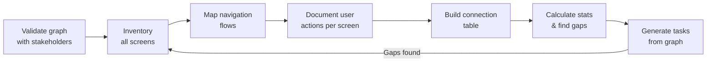
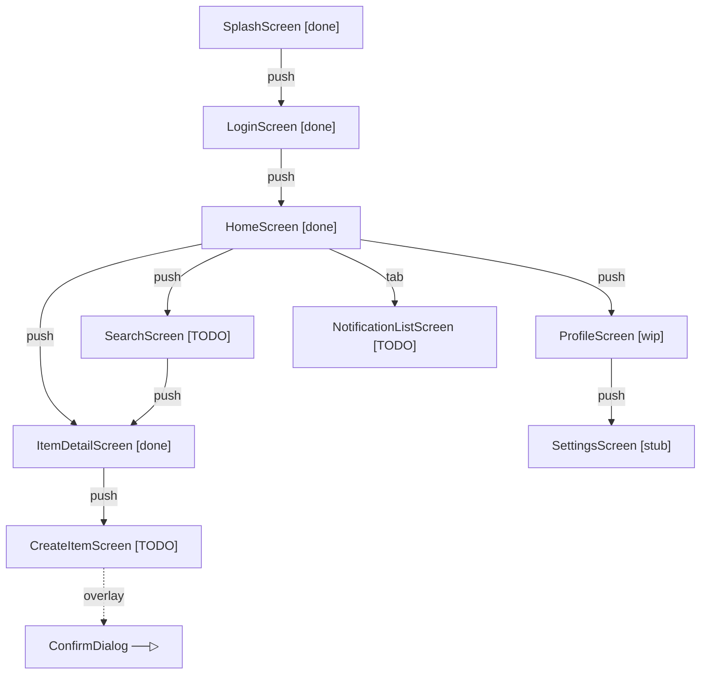

# Blueprint: Screen Interaction Graph

<!-- METADATA — structured for agents, useful for humans
tags:        [ux, navigation, screens, design, planning]
category:    workflow
difficulty:  beginner
time:        1-2 hours
stack:       []
-->

> Map every screen, navigation, overlay, and user action BEFORE writing code — then get stakeholder sign-off.

## TL;DR

Build a complete graph of your app's screens and how they connect (push, pop, overlay, in-place actions). Present it to stakeholders for explicit approval. Only then start implementation. The graph becomes your task list and progress tracker.

## When to Use

- Starting a new app or a major feature with multiple screens
- Onboarding a new agent or developer who needs the full picture
- Screens keep getting added mid-sprint and nobody knows the full scope
- When **not** to use: single-screen utilities or pure backend work with no UI

## Prerequisites

- [ ] A rough idea of the features the app needs (user stories, wireframes, or even a conversation)
- [ ] Access to the stakeholder/user who will validate the graph
- [ ] A text editor or diagramming tool (plain text works fine)

## Overview



## Steps

### 1. Validate with stakeholders — the design gate

**Why**: The graph IS the contract. If you skip validation, the agent or developer builds screens nobody asked for, wires navigation nobody wants, and you discover it after days of work. This step exists to prevent that. No implementation begins without sign-off.

Present the interaction graph (even a rough draft) to the stakeholder or user. Walk through every screen and every transition. Ask explicitly:

- "Is any screen missing?"
- "Is any screen here that shouldn't be?"
- "Does this navigation flow match how you'd use the app?"

Iterate on the graph until you get a clear **"yes, build this."**

> **Decision**: If the stakeholder requests changes, loop back and revise the graph. Do NOT proceed to implementation until approval is given. This is a blocking gate.

**Expected outcome**: An explicitly approved interaction graph. A message, comment, or checkmark that says "approved" — not silence, not "looks fine I guess." Real sign-off.

### 2. Inventory all screens

**Why**: You can't map connections between screens you haven't listed. A complete inventory prevents the "oh, we also need a settings screen" surprise mid-implementation.

List every screen the app will have. Include screens that aren't built yet — mark them. Use status markers consistently:

- `[done]` — implemented and functional
- `[wip]` — partially built
- `[stub]` — file exists, content placeholder
- `[TODO]` — not started

Example inventory:

```
Screens:
  1. SplashScreen           [done]
  2. LoginScreen            [done]
  3. HomeScreen             [done]
  4. ProfileScreen          [wip]
  5. SettingsScreen          [stub]
  6. NotificationListScreen  [TODO]
  7. ItemDetailScreen        [done]
  8. CreateItemScreen        [TODO]
  9. SearchScreen            [TODO]
```

**Expected outcome**: A numbered list of every screen with its current status. No screen left out, no status left ambiguous.

### 3. Map navigation flows

**Why**: Screens don't exist in isolation — users move between them. Mapping flows reveals the real structure of your app: which screens are entry points, which are deep, and which are orphaned.

Use a consistent legend for connection types:

```
Legend:
  ──▶   navigation push (new screen)
  ──▷   bottom sheet / dialog (overlay, screen stays underneath)
  ←──   back / pop (return to previous)
  ⟲     action in-place (no navigation, state change on current screen)
```

**ASCII format** — good for READMEs and plain-text tools:

```
  SplashScreen ──▶ LoginScreen ──▶ HomeScreen
                                      │
                      ┌───────────────┼───────────────┐
                      ▼               ▼               ▼
               ProfileScreen   ItemDetailScreen   SearchScreen
                   │               │                  │
                   ▼               ▼                  ▼
            SettingsScreen    CreateItemScreen    ItemDetailScreen
                                  │
                                  ▼
                          ──▷ ConfirmDialog
```

**Mermaid format** — good for rendered docs and PRs:



**Expected outcome**: A visual graph (ASCII, Mermaid, or both) showing every screen and every navigation edge between them.

### 4. Document user actions per screen

**Why**: Not every user action triggers navigation. Taps, swipes, toggles, and FAB presses may update state in-place. If you only map navigation, you miss half the interaction surface.

For each screen, list every meaningful user action and classify it:

```
HomeScreen:
  - Tap item card        ──▶ ItemDetailScreen
  - Tap search icon      ──▶ SearchScreen
  - Tap profile avatar   ──▶ ProfileScreen
  - Tap bottom tab       ──▶ NotificationListScreen
  - Pull to refresh       ⟲  reload item list (in-place)
  - Tap FAB              ──▶ CreateItemScreen

ItemDetailScreen:
  - Tap edit button      ──▶ CreateItemScreen (edit mode)
  - Tap delete           ──▷ ConfirmDialog (overlay)
  - Tap share            ──▷ ShareSheet (overlay)
  - Swipe image gallery   ⟲  change displayed image (in-place)
  - Tap back             ←── pop to previous
```

**Expected outcome**: Every screen has an action list. Every action is classified as navigation, overlay, or in-place.

### 5. Build the connection table

**Why**: The graph is visual and good for understanding flow. The table is structured and good for tracking status, generating tasks, and catching gaps programmatically.

Create a table with these columns:

```
| #  | From               | To                    | Action          | Type    | Status |
|----|--------------------|------------------------|-----------------|---------|--------|
| 1  | SplashScreen       | LoginScreen            | auto-navigate   | push    | done   |
| 2  | LoginScreen        | HomeScreen             | submit login    | push    | done   |
| 3  | HomeScreen         | ItemDetailScreen       | tap item card   | push    | done   |
| 4  | HomeScreen         | SearchScreen           | tap search icon | push    | TODO   |
| 5  | HomeScreen         | ProfileScreen          | tap avatar      | push    | wip    |
| 6  | HomeScreen         | NotificationListScreen | tap tab         | tab     | TODO   |
| 7  | HomeScreen         | CreateItemScreen       | tap FAB         | push    | TODO   |
| 8  | ProfileScreen      | SettingsScreen         | tap settings    | push    | stub   |
| 9  | ItemDetailScreen   | CreateItemScreen       | tap edit        | push    | TODO   |
| 10 | ItemDetailScreen   | ConfirmDialog          | tap delete      | overlay | TODO   |
| 11 | ItemDetailScreen   | ShareSheet             | tap share       | overlay | TODO   |
| 12 | CreateItemScreen   | ConfirmDialog          | tap save        | overlay | TODO   |
```

**Expected outcome**: A complete connection table. Every edge from the graph appears as a row. No navigation is undocumented.

### 6. Calculate stats and identify gaps

**Why**: Numbers surface problems that eyeballing the graph misses. Orphan screens mean dead code or missing navigation. High depth means UX friction. A big TODO count means you're further from done than you think.

Calculate these metrics from your inventory and table:

```
Stats:
  Total screens:       9
  Done:                4  (44%)
  WIP:                 1  (11%)
  Stub:                1  (11%)
  TODO:                3  (33%)
  Total connections:   12
  Max navigation depth: 4  (Home → Detail → Create → ConfirmDialog)
  Orphan screens:      0
```

Check for:

- **Orphan screens** — screens in the inventory that have no incoming edge in the connection table. They're unreachable.
- **Dead ends** — screens with no outgoing edge and no back action documented.
- **Depth > 3** — signals UX complexity. Consider whether the user really needs that many taps to reach a function.

**Expected outcome**: A stats block and a list of any gaps or concerns found. If gaps exist, loop back to Step 2 and update the inventory and graph.

### 7. Generate tasks from the graph

**Why**: The graph already encodes what to build and in what order. Screens with no dependencies (leaf screens, entry points) can be built first. Screens that depend on others (via navigation) have natural ordering. Don't invent a task list — derive it from the graph.

Convert each screen into a task. Use the connection table to set dependencies:

```
Tasks (ordered by dependency):
  1. [ ] SplashScreen           — no deps, entry point        [done]
  2. [ ] LoginScreen            — depends on: Splash          [done]
  3. [ ] HomeScreen             — depends on: Login           [done]
  4. [ ] ProfileScreen          — depends on: Home            [wip]
  5. [ ] SettingsScreen         — depends on: Profile         [stub]
  6. [ ] ItemDetailScreen       — depends on: Home            [done]
  7. [ ] SearchScreen           — depends on: Home            [TODO]
  8. [ ] NotificationListScreen — depends on: Home            [TODO]
  9. [ ] CreateItemScreen       — depends on: Home, Detail    [TODO]
```

Each task includes wiring the navigation edges from the connection table. When a screen task is completed, update the graph status markers.

**Expected outcome**: A task list derived directly from the graph. Dependencies are explicit. The graph and task list stay in sync throughout implementation.

## Variants

<details>
<summary><strong>Variant: Tab-based app</strong></summary>

For apps with bottom navigation tabs, the HomeScreen is really a shell with N tab destinations. Map the tab bar as a single node with edges to each tab root:

```
  AppShell ──tab──▶ HomeTab
           ──tab──▶ SearchTab
           ──tab──▶ ProfileTab
```

Each tab root then has its own sub-graph of push navigations. Depth counting starts from each tab root, not from the app shell.

</details>

<details>
<summary><strong>Variant: Auth-gated flows</strong></summary>

Some screens are only reachable when authenticated. Split the graph into two zones — public (splash, login, register) and authenticated (everything else). Draw a clear boundary:

```
  [PUBLIC]                    [AUTHENTICATED]
  SplashScreen ──▶ LoginScreen ══▶ HomeScreen ──▶ ...
                                 ↑
  RegisterScreen ──▶ ────────────┘
```

The double-line (`══▶`) marks the auth gate. This matters because navigation guards will enforce it in code.

</details>

## Gotchas

> **Graph not validated with stakeholder**: The agent builds screens from its own assumptions. Three days later, the user says "that's not what I wanted." Massive rework. **Fix**: Step 1 is non-negotiable. Get explicit approval before any implementation begins.

> **Forgetting overlay interactions**: Bottom sheets, dialogs, confirmation popups, and share sheets are real UI surfaces with real logic. If they're not in the graph, they won't be in the task list, and they'll be hacked in at the last minute. **Fix**: Use the `──▷` overlay marker. Treat overlays as first-class nodes in the graph.

> **Graph becomes stale**: New screens get added during implementation but nobody updates the graph. The graph stops reflecting reality, people stop trusting it, and you're back to guessing. **Fix**: Treat the graph as a living document. Every new screen or changed navigation updates the graph FIRST, then the code.

> **Deep navigation depth (4+ levels)**: If a user needs 4+ taps to reach a function, that's a UX smell. It might be correct (e.g., Settings → Account → Privacy → Data Export), but it deserves scrutiny. **Fix**: When stats show max depth >= 4, review with the stakeholder. Consider shortcuts, tabs, or flattening the hierarchy.

> **Confusing push vs replace**: Some navigations replace the current screen (login → home after auth) rather than pushing on top. If you map everything as push, the back-stack will be wrong in implementation. **Fix**: Add a `replace` type to your legend and connection table for transitions that clear the back-stack.

## Checklist

- [ ] Every screen in the app is listed in the inventory with a status marker
- [ ] The interaction graph has been presented to the stakeholder
- [ ] Stakeholder has given explicit approval (not silence — actual sign-off)
- [ ] Navigation edges cover push, pop, replace, tab, and overlay types
- [ ] Every screen has its user actions documented (navigation + in-place)
- [ ] Connection table is complete — every edge in the graph has a row
- [ ] Stats are calculated: total screens, completion %, max depth, orphans
- [ ] No orphan screens exist (or they're intentional and documented)
- [ ] Tasks are generated from the graph with explicit dependencies
- [ ] Graph is stored where the team can update it (repo, wiki, shared doc)

## Artifacts

| Artifact | Location | Description |
|----------|----------|-------------|
| Screen inventory | project doc or README | Numbered list of all screens with status |
| Interaction graph | project doc or README | ASCII or Mermaid visual of screen connections |
| Connection table | project doc or README | From/To/Action/Type/Status for every edge |
| Task list | issue tracker or checklist | One task per screen, dependencies from graph |

## References

- [Material Design Navigation Patterns](https://m3.material.io/foundations/navigation/overview) — canonical navigation types and when to use each
- [Flutter Navigation and Routing](https://docs.flutter.dev/ui/navigation) — implementation patterns for declarative routing
- [Mermaid Flowchart Syntax](https://mermaid.js.org/syntax/flowchart.html) — reference for rendering graphs in Markdown
